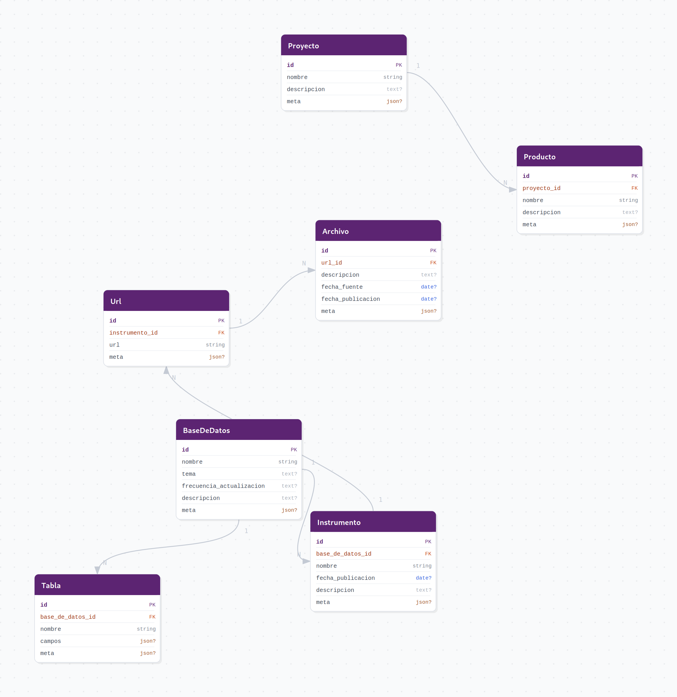
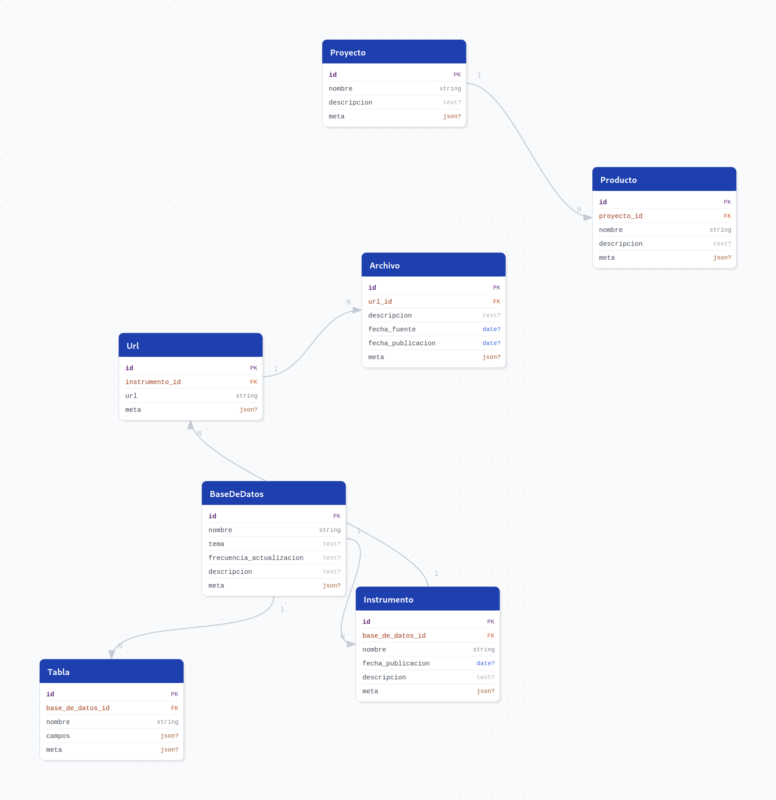
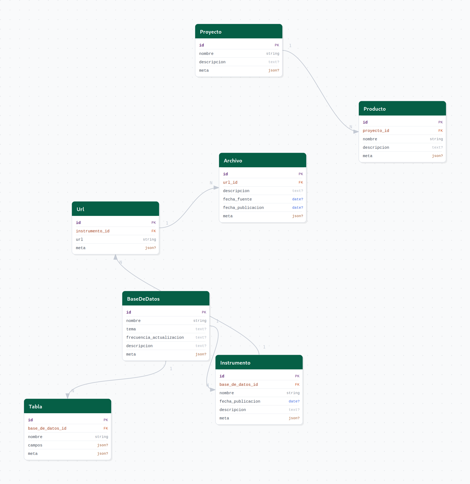
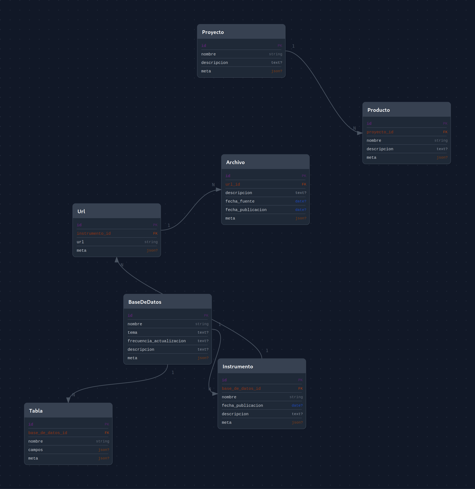
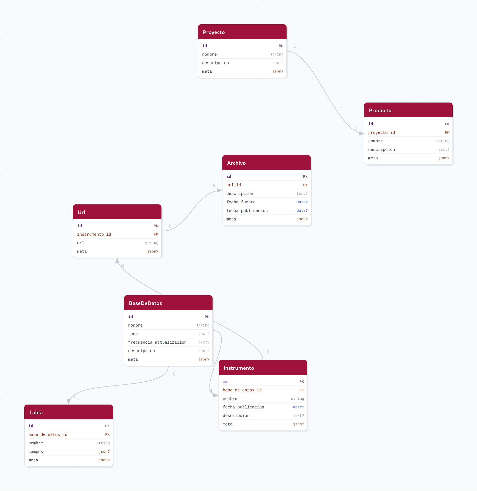
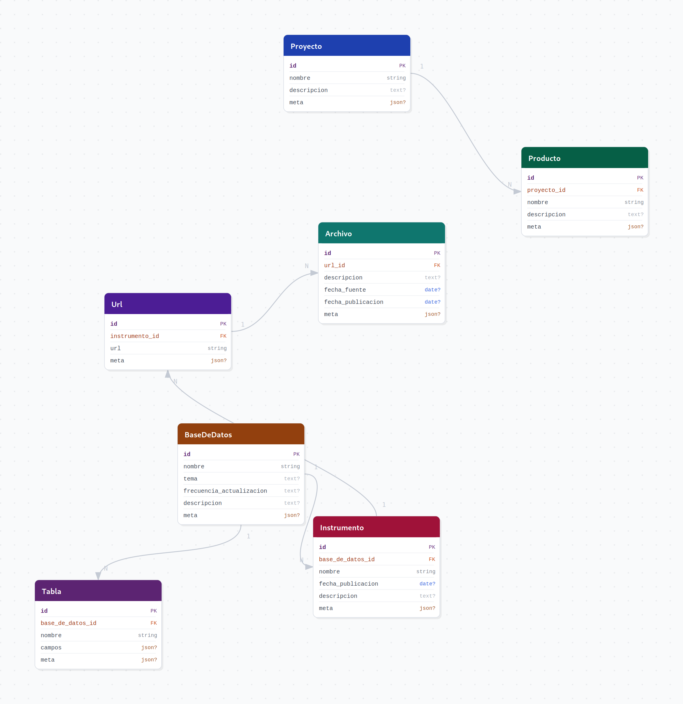

# sqlalchemy-erd

Interactive ERD visualizer for SQLAlchemy 2.0 models. Introspects your `DeclarativeBase` metadata and generates diagram files with no manual configuration required.

- Drag-and-drop interactive HTML output
- Auto-layout via force-directed algorithm
- Hover highlighting for tables and relationships
- Multiple export formats: HTML, SVG, PNG, PDF
- Built-in color themes and per-table color overrides
- Zero dependencies beyond SQLAlchemy

## Installation

```bash
pip install sqlalchemy-erd
```

PNG and PDF export require an optional dependency:

```bash
pip install "sqlalchemy-erd[all]"
```

## Quick start

```python
from sqlalchemy_erd import generate_erd
from myapp.models import Base

generate_erd(Base, output="erd.html")
```

## CLI

```bash
# Interactive HTML (default)
sqlalchemy-erd myapp.models:Base

# Specific format and output path
sqlalchemy-erd myapp.models:Base --format svg --output erd.svg

# With theme and custom title
sqlalchemy-erd myapp.models:Base --format png --theme blue --title "My App"

# Per-table color overrides (JSON)
sqlalchemy-erd myapp.models:Base --colors '{"users": "#1d4ed8", "orders": "#059669"}'

# High-resolution PNG
sqlalchemy-erd myapp.models:Base --format png --scale 3
```

## Python API

```python
from sqlalchemy_erd import generate_erd
from myapp.models import Base

# HTML (interactive, no extra deps)
generate_erd(Base, output="erd.html", format="html")

# SVG (static vector)
generate_erd(Base, output="erd.svg", format="svg")

# PNG (requires cairosvg)
generate_erd(Base, output="erd.png", format="png", scale=2)

# PDF (requires cairosvg)
generate_erd(Base, output="erd.pdf", format="pdf")
```

## Themes

Five built-in themes plus per-table color overrides.

### `default`


### `blue`


### `green`


### `dark`


### `rose`


### Per-table colors

Assign any hex color to individual tables while keeping the rest of the theme:

```python
generate_erd(
    Base,
    theme="default",
    table_colors={
        "users":    "#1e40af",
        "orders":   "#065f46",
        "products": "#9f1239",
    },
)
```



## Supported column types

| SQLAlchemy type | Badge |
|---|---|
| Primary key | `PK` |
| Foreign key | `FK` |
| `String` | `string` |
| `Text` | `text` |
| `Integer` / `BigInteger` / `SmallInteger` | `int` / `bigint` / `smallint` |
| `Float` / `Numeric` | `float` / `numeric` |
| `Date` | `date` |
| `DateTime` | `datetime` |
| `Boolean` | `bool` |
| `JSON` | `json` |
| `Uuid` | `uuid` |

Nullable columns display a `?` suffix (e.g. `text?`, `date?`).

## Relationship types

| Cardinality | Line style |
|---|---|
| 1:N | Solid with arrow |
| N:N | Dashed with arrow |

## Examples

See the [`examples/`](examples/) directory for complete working schemas:

- [`examples/demo.py`](examples/demo.py) - data catalog schema
- [`examples/ecommerce.py`](examples/ecommerce.py) - 1:N chains (Category, Product, Order, Customer)
- [`examples/university.py`](examples/university.py) - N:N via association tables (Student, Course, Professor)
- [`examples/hr.py`](examples/hr.py) - 1:1 and 1:N (Employee, Profile, Department, Project)

## License

MIT
